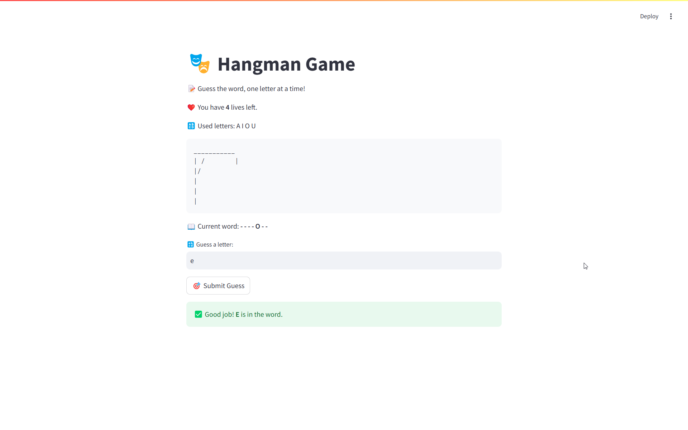

# 🎭 Hangman Game by ZeeJay 🙅‍♂️

A fun and interactive **Hangman Game** built with **Streamlit**. This game challenges you to guess a randomly chosen word one letter at a time before running out of lives. Enjoy a sleek UI, ASCII-based visuals, and an engaging experience with instant feedback!

---

## 🚀 Features

✅ **Interactive UI**: Built with Streamlit for a smooth and responsive experience.  
✅ **ASCII Hangman Graphics**: Classic text-based hangman visuals.  
✅ **Instant Feedback**: Success, warning, and error messages based on guesses.  
✅ **Win Celebration**: Balloons animation when you win. 🎉  
✅ **Easy to Reset & Replay**: Restart the game with a single click.  
✅ **Random Words**: Every game is different!

---

## 📥 Installation & Setup

1️⃣ **Clone the Repository**
```sh
git clone https://github.com/zohaib-javd/hangman-streamlit.git
cd hangman-streamlit
```

2️⃣ **Install Dependencies**
```sh
pip install streamlit
```

3️⃣ **Run the Game**
```sh
streamlit run app.py
```

---

## 🎮 How to Play

- The game randomly selects a **word**.
- You have **7 lives** to guess the word correctly.
- Enter a **single letter** and click **Submit Guess**.
- If the letter is in the word, it will be revealed!
- If the letter is wrong, you **lose a life**.
- The game ends when:
  - You guess the word (**win** 🎉), or
  - You run out of lives (**lose** 💀).
- Click **Restart Game** to play again.

---

## 📸 Game Preview

  
*An engaging Streamlit Hangman game with ASCII visuals!*

---

## 📩 Contact & Socials

👤 **Zohaib Javed (ZeeJay)**  
🔗 [LinkedIn](https://linkedin.com/in/zohaib-javd)  
🌍 [GitHub](https://github.com/zohaib-javd)  
📧 [Email](mailto:zohaibjaved@gmail.com)  

---

## 🌟 Contributing

If you want to **improve** the game, feel free to **fork** this repository and submit a pull request! 😊

---

## 📜 License

This project is **open-source** and available under the **MIT License**.

